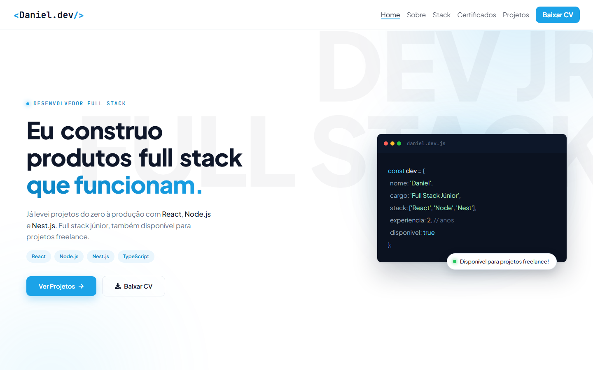
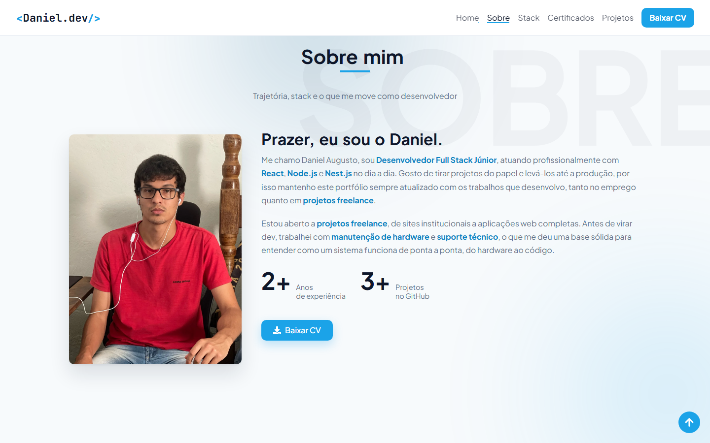
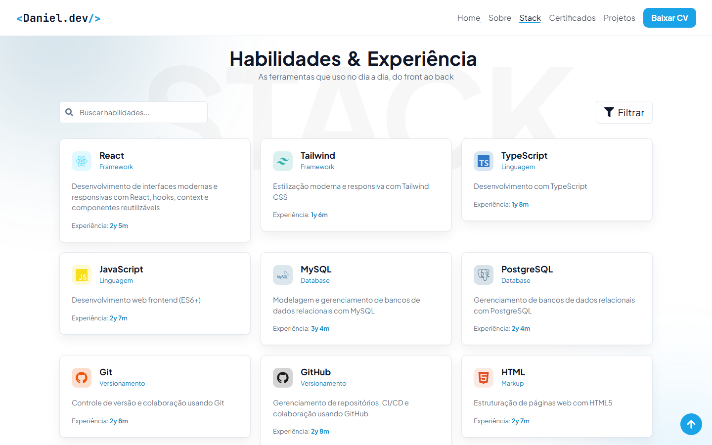
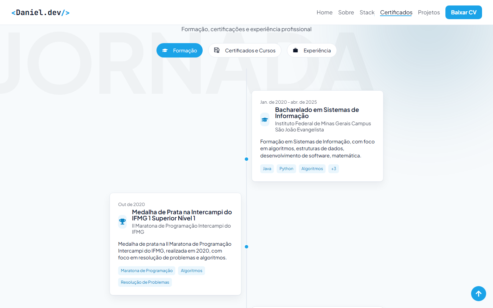
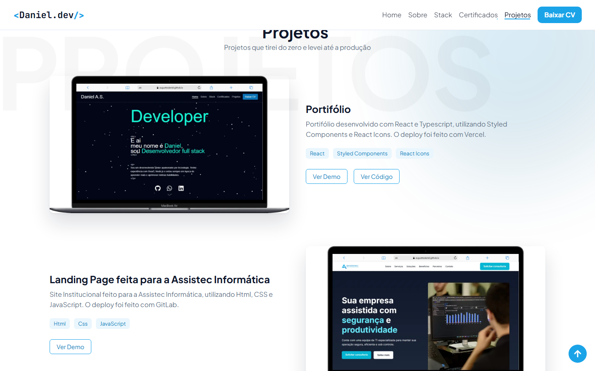
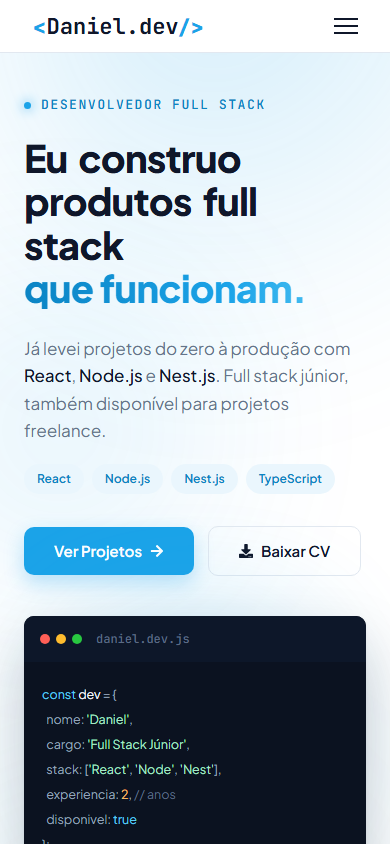

# Portfólio — Daniel Augusto Silva


**[🔗 Ver o portfólio no ar](https://portifolio-dev-two-plum.vercel.app/)**

## 📋 Sobre o Projeto

Portfólio profissional desenvolvido com React, apresentando minhas habilidades, projetos e experiência como Desenvolvedor Full Stack Júnior — também disponível para projetos freelance. Interface clara e responsiva, com animações e microinterações construídas com Framer Motion e Lenis.

O site também foi otimizado para ser lido tanto por pessoas quanto por agentes/LLMs: conteúdo real renderizado no HTML (sem depender de JS para ser indexado), dados estruturados (JSON-LD), negociação de conteúdo em Markdown, `llms.txt` e páginas de apoio (`/about`, `/contact`, `/privacy`).



## ✨ Funcionalidades

- **Design Responsivo**: adaptado para mobile, tablet e desktop
- **Scroll Suave**: rolagem com inércia via [Lenis](https://lenis.dev/), sincronizada ao loop de animação do Framer Motion
- **Animações ao Rolar**: seções e textos revelados progressivamente com `whileInView`
- **Efeitos de Hover**: cards com leve inclinação 3D (tilt) e botões com efeito magnético, desativados automaticamente em dispositivos sem mouse
- **Stack com Busca, Filtro e Paginação**: habilidades filtráveis por categoria e por texto
- **Timeline Interativa**: formação acadêmica, cursos/certificações e experiência profissional em abas
- **Animação de Download**: ícone do currículo "voa" até o botão de download do header ao clicar em "Baixar CV"
- **SEO e Agent-Readiness**: JSON-LD, sitemap, `robots.txt`, `llms.txt`, negociação de conteúdo em Markdown e páginas estáticas de apoio
- **Deploy Duplo**: publicado na Vercel (produção) e compatível com GitHub Pages

## 🖼️ Capturas de Tela

<table>
  <tr>
    <td></td>
    <td></td>
  </tr>
  <tr>
    <td></td>
    <td></td>
  </tr>
</table>



## 🚀 Tecnologias Utilizadas

- **[React 19](https://react.dev/)** — biblioteca para construção de interfaces
- **[Vite 6](https://vite.dev/)** — build tool e servidor de desenvolvimento
- **[Styled Components 6](https://styled-components.com/)** — CSS-in-JS
- **[Framer Motion 12](https://motion.dev/)** — animações e transições
- **[Lenis](https://lenis.dev/)** — scroll suave
- **React Icons** — ícones da interface
- **[Vercel Speed Insights](https://vercel.com/docs/speed-insights)** — métricas de performance em produção

## 🛠️ Instalação e Uso

1. Clone o repositório:
```bash
git clone https://github.com/AugusttoDaniel/Portifolio-dev.git
cd Portifolio-dev
```

2. Instale as dependências:
```bash
npm install
```

3. Execute o projeto em modo de desenvolvimento:
```bash
npm run dev
```

4. Build de produção:
```bash
npm run build
```

5. Deploy manual no GitHub Pages:
```bash
npm run deploy
```

6. Verificar a saúde de SEO/agent-readiness (contra a URL de produção, ou passando outra como argumento):
```bash
npm run verify:agent-readiness
```

## 📂 Estrutura do Projeto

```
Portifolio-dev/
├── docs/
│   └── screenshots/       # Imagens usadas neste README
├── public/                # Arquivos estáticos servidos como estão (favicons, robots.txt, sitemap.xml, llms.txt, páginas de apoio)
├── api/                   # Função serverless da Vercel (negociação de conteúdo em Markdown)
├── src/
│   ├── assets/            # Imagens usadas dentro do app
│   ├── components/        # Componentes reutilizáveis
│   │   ├── header/ footer/ button/
│   │   ├── timeline/ timelineitem/      # Timeline de formação/experiência
│   │   ├── tiltCard/ magneticButton/    # Microinterações de hover
│   │   ├── revealText/                  # Animação de texto palavra a palavra
│   │   └── loadingspinner/
│   ├── hooks/              # Hooks reutilizáveis (ex: useIsPhone)
│   ├── mocks/              # Dados do portfólio (projetos, skills, certificações)
│   ├── pages/               # Seções principais do site
│   │   ├── developerprofile/  # Hero / Perfil do desenvolvedor
│   │   ├── abountme/          # Sobre mim
│   │   ├── mystacks/          # Stack tecnológica
│   │   ├── certification/     # Formação e experiência
│   │   └── projects/          # Projetos
│   ├── styles/             # Tema e estilos globais
│   ├── utils/               # Utilitários (scroll, animação de download)
│   ├── App.jsx
│   └── main.jsx
├── package.json
├── vite.config.js
└── vercel.json
```

## 🔍 Seções Principais

- **Perfil do Desenvolvedor**: apresentação inicial com headline, badge de disponibilidade e atalhos para projetos/currículo
- **Sobre Mim**: trajetória, stack e estatísticas
- **Stack Tecnológica**: habilidades com busca, filtro por categoria e paginação
- **Formação e Experiência**: timeline com abas para acadêmico, cursos/certificações e experiência profissional
- **Projetos**: trabalhos reais, com descrição, tecnologias usadas e links para demo/código

## 🌐 Deploy

- **Produção**: [Vercel](https://portifolio-dev-two-plum.vercel.app/), com deploy automático a cada push
- **Alternativo**: [GitHub Pages](https://augusttodaniel.github.io/Portifolio-dev/), publicado manualmente via `npm run deploy`

## 📫 Contato

- E-mail: [danielsje7133@gmail.com](mailto:danielsje7133@gmail.com)
- LinkedIn: [linkedin.com/in/danielaugustto](https://www.linkedin.com/in/danielaugustto/)
- GitHub: [github.com/AugusttoDaniel](https://github.com/AugusttoDaniel)
